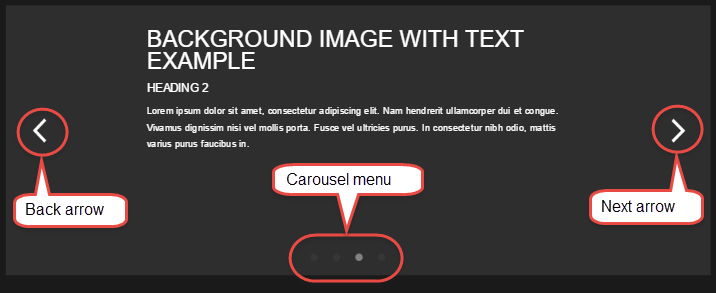

#Deloitte test  - Adam Lemmo  - 2017-02-22

>  Note:- A Word document has been created of this document with nicer formatting, go here:-  [deloitte-adamlemmo-2017-02-22-readme.doc](docs/deloitte-adamlemmo-2017-02-22-readme.doc) (although this readme will be more up to date).

##A description of the files included:- 

| File name and path       | Description           | 
|:------------- |:-------------| 
|[index.html](index.html) | The main HTML file|
|[css/bootstrap.css](css/bootstrap.css) |	Bootstrap main css|
|[css/ie10-viewport-bug-workaround.css](css/ie10-viewport-bug-workaround.css) |	Bootstrap IE10 css bug css|
|[css/deloitte-test.css](css/deloitte-test.css) |	The specific styles for the test, including Bootstrap overrides|
|[img/carousel-arrow-left.png](img/carousel-arrow-left.png) |	Left arrow for the carousel|
|[img/carousel-arrow-right.png](img/carousel-arrow-right.png)  |	Right arrow for the carousel|
|[img/carousel-menu-dot.png](img/carousel-menu-dot.png) |	Sprite image for the indicator dot of the carousel|
|[img/feature-image-001.png](img/feature-image-001.png) |	Used as a background image for one of the carousel slides|
|[img/feature-image-002.png](img/feature-image-002.png) |	Used as a background image for another of the carousel slides|
|[img/image-placeholder-portrait.png](img/image-placeholder-portrait.png) |	Placeholder image in portrait orientation|
|[img/image-placeholder-project.png](img/image-placeholder-project.png) |	Small project image used at the end of the page|
|[img/image-placeholder-landscape.png](img/image-placeholder-landscape.png) |	Placeholder image in landscape orientation|
|[js/bootstrap.min.js](js/bootstrap.min.js)	| Main bootstrap Javascript file|
|[js/carousel.js](js/carousel.js)	| Carousel Javascript file|
|[js/jquery.min.js](js/jquery.min.js)	| Jquery Javascript file|
|[js/modal.js](js/modal.js)	| Modal Javascript file|


 
#General methodology
In writing the code for the various parts of this test, I have included comments throughout in order to 1. make sense of the code myself, and 2. help others who are reading this also make sense of the code. This is by no means a perfect process, it makes sense to the author, but a third party might find it difficult, I am open to conversation about this, as working in a team can reveal different ways to approach this subject, I’ve done my best!

#Browsers
The [index.html](index.html) page was checked in the latest versions of Google Chrome, Internet Explorer 11, Microsoft Edge and Firefox.
The main development browser used was Chrome, mainly due to speed and development tools, such as the code inspector and Javascript console for debugging. The responsiveness of the page was checked in Chrome and Firefox, using their respective development tools, desktop, mobile and tablet sizes were checked.

#HTML
I have written all of the HTML myself, using the Bootstrap grid as a basis. I have used the HTML5 elements `<figure>` and `<figcaption>` for a more semantic page.

#CSS
The css of this page uses Bootstrap as a starting point, mainly for its responsive grid system. I have included a custom CSS file that adds new classes and overrides some Bootstrap styles, the majority of the work has been done in the [deloitte-test.css](css/deloitte-test.css) css file.

#Javascript
I have written all of the Javascript in the [carousel.js](carousel.js) and [modal.js](modal.js) files. I have separated these out into their own files for more targeted editing of each given functionality.

#Accessibility
Accessibility has been considered in that all elements that link to something are using an `<a href=”#”>` so as to expose these to assistive technologies. No custom tab order has been used, all elements should naturally flow with the normal tab behavior of the browser. Also the `<figure>` and `<figcaption>` tags have been used as mentioned above, in an attempt to relate the captions to their respective images.

#Carousel
The carousel was built entirely by myself, it functions largely using the jQuery Animate function. I have used this functionality of jQuery on several occasions before, and I am happy with the results.

Here’s a diagram describing the anatomy of the carousel.

   

By default, the carousel automatically animates, but this can be easily switched off if required.

The arrows change the carousel slides either forward (2) through the list of supplied slides, or backward (1), depending on which arrow link is selected. The menu (3) at the bottom of the carousel can also be used to switch to a specific slide as well. 

The Javascript has been written in such a way as to allow for more than the default amount of slides to be added, also this number can be subtracted as well.

#Customisation

##Adding a slide
Duplication of the div tag with the `slide` class below, will result in a new slide being added to the carousel. The two classes, `slide` and `slide-content` are mandatory for the optimal appearance of a slide.
```html
<!-- carousel -->
<div class="container carousel">
 <div id="carousel">
  <a href="#" class="carousel-arrow carousel-arrow-left"></a>
  <div id="carousel-slides">
  <div class="slide"> 
    <div class="slide-content">
     <div class="slider-header1-text text-center">Example 1</div>
    </div>
  </div>
  <div class="slide"> 
   <div class="slide-content">
    <div class="slider-header1-text">Plain text example</div>
    <div class="slide-text">Lorem ipsum dolor sit amet.</div>
   </div>
  </div>
  </div>
  <a href="#" class="carousel-arrow carousel-arrow-right"></a>
 </div>
</div>
```

##Modifying a slide

The contents of the div with the slide-content class can be modified with specific text, predefined classes are provided for standard slide elements.
```html
<!-- carousel -->
<div class="container carousel">
 <div id="carousel">
  <a href="#" class="carousel-arrow carousel-arrow-left"></a>
  <div id="carousel-slides">
  <div class="slide"> 
    <div class="slide-content">
     <div class="slider-header1-text text-center">Example 1</div>
    </div>
  </div>
  <div class="slide"> 
   <div class="slide-content">
    <div class="slider-header1-text">Plain text example</div>
    <div class="slide-text">Lorem ipsum dolor sit amet.</div>
   </div>
  </div>
  </div>
  <a href="#" class="carousel-arrow carousel-arrow-right"></a>
 </div>
</div>
```

##Configuration options

At the bottom of the index.html page, there is an object literal included that can be used to alter the animation speed in, delay and the speed out of the slides. Adjusting the numbers below will yield different animation speed results, care should be taken when using this, as too much speed could potentially limit the time taken to read a given slide, and too slow a value could give the impression that nothing is happening at all!

```javascript
 var sliderCustomiser = {
  speedIn:.5,
  delay:5,
  speedOut:.25
 };
 ```

#Modal
The Bootstrap modal has been used as a basis for the modal on this page. The CSS of this element has been altered to appear as per the PSD provided. The functionality was written based on the brief given, see issues (2) below for more of a description of this.
 
#Issues
1.	The fonts referred to in the PSD file were not present on my computer, and so these were substituted with a close match to what is presented in the PSD.

2.	The implied functionality of the UI in the PSD, indicates that the [+] plus icon overlaid on the large images, is intended to be the selection for the modal box, but the PSD indicates that this [+] plus icon be present for all large images without captions, the brief mentions the following...

   > “Large images without captions will have a modal window that displays the caption on click of the image.” 

   With this in mind, I have not included the [+] plus icon on the images with captions, and only included the icon on images without a caption represented in the PSD.

3.	Under the heading “More Layouts” the captions for the images in the second row, (the smaller images that are side-by-side) have an unusual image caption requirement. Specifically, I couldn’t work out a way to nicely, and semantically, associate the caption with the images in that second row, here’s a screenshot to illustrate the issue.

   

   This would require either more time to work out a proper solution, or going back to the designer and suggesting a different layout that may work a bit nicer.
